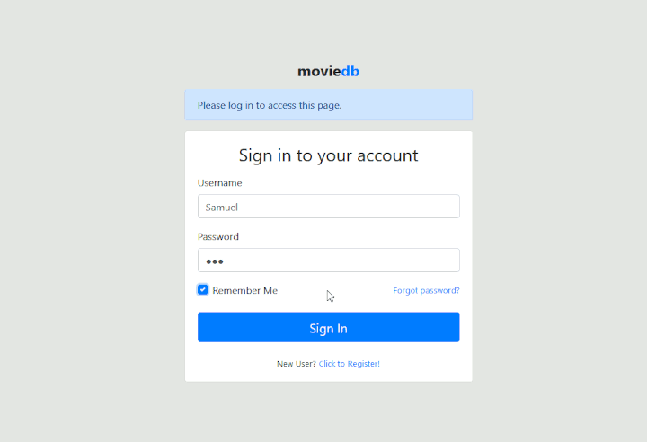

# moviedb
A web application based on flask and boostrap 4 to browse movies, actors and directors, manage a watchlist, write reviews etc.

It's using some data from the open [IMDB dataset](https://datasets.imdbws.com/) as example data.

## Features
- user login and authorization
- manage a list of movies and actors
- create, update and delete entries
- manage relationships (actors and roles in movies)
- search functionality for movies and actors etc.
- manage a watchlist
- write reviews and rate movies

## ToDo
### Step 1
- DONE flesh out application structure, user model and movie model
- DONE create login and register page
- DONE create list view, details view and edit form for movies
- DONE order movies by columns

### Step 2
- DONE refactor using blueprints
- DONE add a actor model
- DONE add association table
- DONE search for movies
- DONE list view, details view and edit form for actors
- create link for director
- DONE update release_date to release_date_uk
- edit form for character records
- hook to update person score when character records are created / updated
- display dates and times locally
- filter movies by category, sort order...

### Step 3
- users can add and remove movies to / from their watchlist
- user comments and ratings on movies
- authorization (users can view, manage watchlist and write reviews, admins can edit and delete movies and actors)
- export movies etc. to csv/json
- import movies etc. from csv/json
